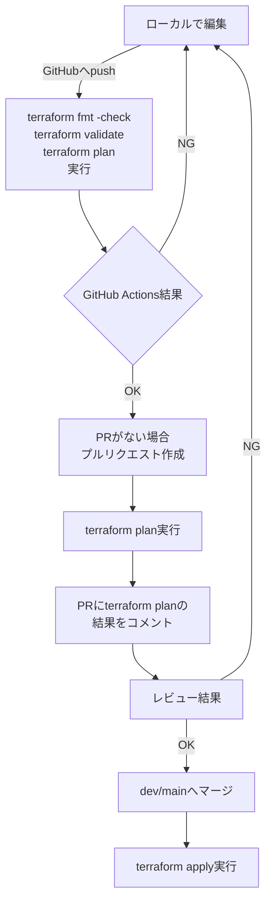

# Terraform使用環境下でのCI/CD構築

このリポジトリは、GitHub Actionsを使用してTerraformの開発環境のCI/CDを構築することを目的としています。</br>
構築までの手順や参考となりそうな記事など、個人用のメモとして様々な情報を残しています。

## 達成したいCI/CDのフロー




## 実行手順

### VSCodeとGitHubの連携（SSH）

1. GitHubの設定でSSHキーを生成し、リポジトリに追加します。
2. VSCodeでSSHを使用してリポジトリにアクセスできるように設定します。

### Terraformのインストール

Terraformは以下のリンクからインストールできます。

- [Terraformインストールガイド](https://developer.hashicorp.com/terraform/install#darwin)

### Google Cloud アカウントの作成

Google Cloudアカウントを作成するには、以下のリンクを参照してください。

- [Google Cloud アカウント作成ガイド](https://cloud.google.com/apigee/docs/hybrid/v1.8/precog-gcpaccount?hl=ja)

### gcloud CLIのインストール

gcloud CLIは以下のリンクからインストールできます。

- [gcloud CLIインストールガイド](https://cloud.google.com/sdk/docs/install?hl=ja)

### gcloud CLIの認証

ターミナルで以下のコマンドを実行し、gcloud CLIの認証を完了させます。

```bash
gcloud auth login
```

### GCP サービスアカウント作成（ロールはオーナー）
- [サービス アカウントを作成する | IAM Documentation](https://cloud.google.com/iam/docs/service-accounts-create?hl=ja)


### サービス アカウント キーを作成
- [サービス アカウント キーの作成と管理](https://cloud.google.com/iam/docs/creating-managing-service-account-keys?hl=ja)

### GithubのSecretsにJSONを登録
- [GitHub Actions でのシークレットの使用](https://docs.github.com/ja/actions/security-for-github-actions/security-guides/using-secrets-in-github-actions)

### 参考

- GitHub Actionsは無料枠では2000分/月しか使えない。
  [Qiita記事](https://qiita.com/technote-space/items/7b2694786f577c823fc1)

- `env/stg/` 配下にある複数のフォルダ内にあるファイルに対して、どのようにして `terraform plan` をしたのか。丸本さんに聞く。

- めっちゃ参考になりそうな公式サイト:
  [Terraformのベストプラクティス](https://cloud.google.com/docs/terraform/best-practices-for-terraform?hl=ja)
